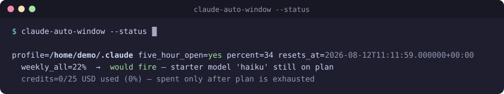
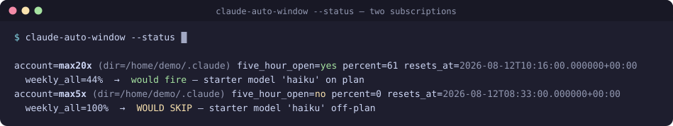

# claude-auto-window

Keep a **Claude Code 5-hour usage window** perpetually open — back to back — so
there's no cold-start wait the moment you actually want to use Claude. When the
current window has lapsed, it opens a fresh one with a single trivial request.
That one request anchors a new 5-hour window at minimal token cost.

<p align="center">
  
</p>

There are **two opener strategies** (`--opener`):

- **`http`** (default) — replicate the request Claude Code itself sends: **one raw
  `POST /v1/messages`** using the OAuth token Claude Code already stored, spoofing
  the Claude Code identity so the subscription token is accepted. **No tmux, no
  `claude` binary** — just `curl`. Falls back to the `tmux` opener when the token
  needs refreshing. See *Opener strategies*.
- **`tmux`** — drive a *real interactive* Claude Code session in a throwaway
  **tmux** session: send one trivial prompt, wait for the reply, quit, tear it
  down. Most faithful, and it self-heals an expired token on its own.

Useful if you're on a **Claude Pro/Max** plan and want your 5-hour windows to
roll continuously (e.g. overnight, or on a always-on box) so you never lose time
waiting for a new window to start after you hit a limit.

> **Works on plans that have a 5-hour session window — i.e. Claude Pro/Max**
> (and any seat on the same rolling-window rate-limit model). **API/usage-billed
> seats** (many Team/Enterprise/console setups) have no such window, so there's
> nothing to keep open. Every mode **detects this and refuses to fire** by
> default (`--once` no-ops, `--daemon` exits cleanly, `--run` refuses unless you
> pass `--force`) — because on a per-token-billed seat, firing would just cost
> money for no benefit.

## How it works

1. **Check** — read Claude Code's OAuth usage endpoint directly for the `session`
   (5h) limit's `resets_at`. No API key needed — Claude Code's existing login is
   used (token resolution + fetch are built in; no external dependency).
2. **Self-heal (only if the stored token has expired)** — >8h without any Claude
   activity leaves the stored access token expired, so the check can't
   authenticate. The tool then launches a bare, **prompt-less** `claude` session
   in the throwaway tmux — nothing is sent, no window opens, nothing is spent —
   which makes the CLI refresh its own token within seconds; tear down, re-check
   with the fresh token. (See *Authentication* for the full story.)
3. **Stop if open** — a window is already running → do nothing.
4. **Jitter** — window closed → wait `0..jitter-max` seconds (default 180), then
   re-check (normal activity during the jitter may have already opened one).
5. **Open a window** using the selected opener. The default **`http`** opener is
   a single `POST /v1/messages` (see *Opener strategies*); with **`--opener tmux`**
   this expands to the full interactive-session dance (steps 5a–5e):
   - **5a. Open a tmux session** — unique name on an isolated socket
     (`-L claude-auto-window`), never touching your real tmux server.
   - **5b. Run** `claude "Reply with exactly: OK."` **directly** as the pane's
     process (not typed into a shell, so there's no command-echo noise), as light
     as possible (see *Minimal footprint*).
   - **5c. Wait for the reply** — poll `capture-pane`, filter out the prompt-echo
     lines, and match Claude's own reply (`OK.`). If the first-run
     **workspace-trust dialog** appears, it's accepted automatically (Enter → the
     default "Yes, I trust this folder") — safe because the starter dir is a
     dedicated dir you own.
   - **5d. Quit** — send `/exit`; if still running, `Ctrl-C Ctrl-C`; then
     `kill-session` by name unconditionally (in an `always` block).
   - **5e. Clean up** — delete the starter's own transcript.
6. **Verify** the window flipped active (best-effort; the usage endpoint lags a
   few minutes, so a received reply / HTTP 200 is already treated as success).

A per-profile lock prevents two starters racing for the same account, and a
**balance gate** skips the starter when the plan bucket that would cover it is
exhausted (so the tool never burns usage credits to anchor a worthless window —
see *Balance gate*). One daemon (or one `--once`/`--run`/`--status`/`--reset`)
can service several profiles at once, each checked and opened independently —
see *Profiles (multi-account)*.

## Opener strategies

The step that actually anchors a window is pluggable via `--opener`
(`CLAUDE_AUTO_WINDOW_OPENER`). Both anchor a window identically — a completed
request on the subscription OAuth login — they differ only in *how* that request
is made.

| | `http` (default) | `tmux` |
|---|---|---|
| Mechanism | One raw `POST /v1/messages` via `curl` | Real interactive `claude` in a throwaway tmux session |
| Needs | `curl` + `jq` only | `tmux` **+** the `claude` binary |
| Footprint | A single HTTP round-trip (~1 s) | Full TUI launch, pane polling, teardown |
| Expired-token self-heal | Delegates to `tmux` (see below) | Built in (the launch refreshes the token) |
| Trust dialog / transcript | N/A (no session created) | Handled / cleaned |

**Why `http` works.** A subscription OAuth token is normally rejected on
`/v1/messages`. Claude Code gets it accepted by presenting as itself, and the
`http` opener replicates exactly that:

- header `anthropic-beta: oauth-2025-04-20`, and
- a `system` prompt whose first block is **exactly**
  `You are Claude Code, Anthropic's official CLI for Claude.`

With both present the token is accepted and the completed request anchors the
window — no API key, nothing billed beyond the tiny message (which the balance
gate already governs).

**The one thing `http` can't do — and the fallback.** Only a real `claude`
launch can refresh an expired access token (via the stored refresh token). So
when the token is expired/absent, or the request is auth-rejected (`401/403`),
the `http` opener **automatically falls back to the `tmux` opener**, which
self-heals the token and sends. Net effect: `http` is the light fast-path for the
common case (token still valid — the vast majority of fires), with `tmux` as the
safety net. That's also why the daemon's existing expired-token self-heal
(bare prompt-less `claude` launch, step 2) still runs *before* the opener under
`--once`/`--daemon`, so `http` usually finds a fresh token waiting.

**Model note.** The `http` opener needs a **concrete** API model id
(`--http-model`, default `claude-haiku-4-5-20251001`) — the CLI's `haiku` *alias*
(`--model`) is not a valid API model id. If the configured http model is retired,
the request falls back to the `tmux` opener (which understands aliases and the
account default).

```sh
# http is the default — a window is anchored via a single HTTP request:
claude-auto-window --run
# Fall back to the interactive tmux opener explicitly if you ever need it:
claude-auto-window --run --opener tmux
```

## claude-profile integration (serial / multi-subscription accounts)

[claude-profile](https://github.com/deviationist/claude-profile) runs several
subscriptions ("accounts") inside **one** Claude Code config dir, swapping only
the OAuth credential — one account is *live* in the dir at a time, the rest
*parked*. claude-auto-window keeps **every** account's 5-hour window open at once,
including the parked ones.

**Why this needs the http opener.** A parked account's window **cannot** be
anchored by the `tmux` opener: a real `claude` launch always uses whichever
account is *live* in the dir, never a parked one. Anchoring a parked account
requires an HTTP request carrying *that account's* token — with no session and no
credential swap. That request lives inside claude-profile (which alone can safely
mint a fresh token per account, live or parked, under its mutation lock) as its
`anchor-window` porcelain, so **the token never leaves claude-profile**.
claude-auto-window stays the orchestrator: it discovers accounts, applies the same
window-check / balance-gate / breaker / cooldown / jitter logic *per account*, and
delegates the anchor. **Serial/parked support is therefore http-only by
construction.**

Controlled by `--claude-profile` (`CLAUDE_AUTO_WINDOW_CLAUDE_PROFILE`):

| Mode | Behavior |
|---|---|
| `auto` (default) | If claude-profile's config + script are found, keep every account's window open (parked included). Otherwise behave traditionally. |
| `on` | Require claude-profile (warn if its config/script is missing). |
| `off` | Ignore claude-profile entirely — pure single-window behavior on each dir's *live* credential. The escape hatch. |

With no `--profile`/`--config-dir` given and claude-profile active, the default
target set becomes **every account across every claude-profile profile**. An
explicit `--profile NAME` restricts to that profile's accounts (and its dir is
resolved from claude-profile's own config, so the two tools never disagree).

- **Requirement:** claude-profile installed with its `anchor-window` porcelain
  (`claude-profile anchor-window …`). claude-auto-window invokes `claude-profile.py`
  by path (auto-discovered; override with `--claude-profile-py`), since the daemon
  runs headless where the zsh `claude-profile` function isn't sourced.
- **Division of labor:** claude-profile's own keep-alive daemon renews *refresh
  tokens* (week-scale); claude-auto-window anchors *5-hour windows*. Complementary,
  not overlapping.
- **Live-account fallback:** if the *live* account's token has lapsed, the anchor
  falls back to a `tmux` launch in the dir (which refreshes it and anchors). Parked
  accounts have no such fallback — an aged-out parked refresh token needs
  `claude-profile auth <account>`.

<p align="center">
  
</p>

```sh
# Keep BOTH subscriptions' windows open (parked one included), no rotation:
claude-auto-window --run          # or --daemon
claude-auto-window --status       # one block per account
# Force pure single-window (traditional) behavior:
CLAUDE_AUTO_WINDOW_CLAUDE_PROFILE=off claude-auto-window --status
```

## Requirements

- **zsh**, **jq**, **curl** — always (the default `http` opener needs only these).
- **tmux** + the **`claude`** binary — for the `--opener tmux` strategy, and as
  the default `http` opener's expired-token fallback. The `http` fast path needs
  neither, but keep them installed unless you're certain the token will always be
  fresh (i.e. the account sees regular Claude activity).
- **Claude Code** logged in for the profile you want kept open (this is what
  stores the OAuth token both openers read).
- A **Claude Pro/Max** account (see note above).
- **Optional: [claude-profile](https://github.com/deviationist/claude-profile)**
  (plus **python3**, which it's invoked with) — only if you keep multiple
  subscriptions in one config dir and want *all* their windows held open. See
  *claude-profile integration*.

### Authentication

There's no separate login. The tool reuses the **OAuth token Claude Code already
stored** when you ran `claude` and logged in through the browser — the same token
Claude Code uses itself. It's read per config-dir:

- **Linux / headless:** `<config-dir>/.credentials.json` (e.g.
  `~/.claude/.credentials.json`) → `.claudeAiOauth.accessToken`.
- **macOS:** the login **Keychain**, service `Claude Code-credentials-<hash>`
  where `<hash>` = first 8 hex of `sha256(absolute config-dir path)` — this is how
  Claude Code namespaces multiple accounts. The first read may prompt for Keychain
  access; click **Always Allow** once.

The freshest non-expired token is used. Access tokens live ~8 hours and only a
real `claude` launch refreshes them (via the stored refresh token, itself valid
for ~3 days) — so after >8h without any Claude activity the stored token is
expired and the window check can't authenticate. That's fine — the checked
paths **self-heal**: `--once` and the daemon detect the expired token locally,
launch a bare `claude` session with **no prompt** in the usual throwaway tmux
(nothing is sent, no window is opened, nothing is spent — the CLI refreshes the
token at startup, within seconds), tear it down, and re-run the window check
with the fresh token. Only if that refresh launch fails do they fall back to
firing a starter directly (whose send also refreshes). After several days of
total inactivity the refresh token expires too — then the self-heal can't work,
the starter gets no reply, the circuit breaker catches it, and a manual Claude
Code session / `/login` for that account resolves it. No `ANTHROPIC_API_KEY`
is involved (the starter explicitly strips it so the subscription login is
used).

## Install

Clone the repo, then symlink the script onto your `PATH`:

```sh
git clone https://github.com/deviationist/claude-auto-window.git
cd claude-auto-window
mkdir -p ~/.local/bin ~/.local/state/claude-auto-window
ln -sf "$PWD/claude-auto-window" ~/.local/bin/claude-auto-window
claude-auto-window --status      # smoke test: prints your current 5h state
```

It's a **single self-contained script** — the OAuth token read + usage fetch are
built in, no other files to install.

## Modes

```sh
claude-auto-window              # --once: check; if closed, jitter + open (default)
claude-auto-window --run        # open one now — no window-state checks, no jitter
claude-auto-window --run --force  # ...and skip even the "no 5h window" safety check
claude-auto-window --daemon     # service every profile, sleeping until the next expiry
claude-auto-window --status     # print current 5h session state
claude-auto-window --reset      # clear a tripped circuit breaker (see below)
```

`--status` colorizes its output when stdout is a terminal — the window state, the
balance-gate verdict and a tripped breaker each get a color — and falls back to
plain text when piped or redirected, so it stays greppable. Force either way with
`--color always` / `--color never`; [`NO_COLOR`](https://no-color.org) always
wins. Log output is never colorized.

## Profiles (multi-account)

**One daemon (or one `--once`/`--run`/`--status`/`--reset`) services N profiles.**
Each profile is checked and opened independently against its **own** stored OAuth
login, serially (no concurrency), with **per-profile failure isolation** — one
account's fault doesn't stall the others. A single-profile invocation behaves
exactly as before, and existing `<hash>.state` files carry over unchanged.

The `default` profile is a transparent passthrough: `CLAUDE_CONFIG_DIR` is never
set, so Claude Code resolves `~/.claude` exactly as a bare `claude` call would.
Any other profile is an absolute config dir, pinned via `CLAUDE_CONFIG_DIR` only
for that profile's launch.

Three ways to name profiles (a name is `default`, an absolute dir, or a
**claude-profile profile name**):

```sh
# 1. Repeatable CLI flags — accumulate in order:
claude-auto-window --profile default --config-dir /path/to/prof   # mix freely
claude-auto-window --profile work --profile personal   # names from claude-profile

# 2. The PROFILES env/config knob — comma- and/or space-separated:
CLAUDE_AUTO_WINDOW_PROFILES="work personal" claude-auto-window

# 3. Legacy single pin (still honoured):
CLAUDE_AUTO_WINDOW_CONFIG_DIR=~/.claude-personal claude-auto-window
```

- `default` → `~/.claude` (unpinned). Any other **name** is resolved from
  [claude-profile](https://github.com/deviationist/claude-profile)'s own
  `config.json` (defined per-machine there, not hardcoded here) — so
  `--profile work` / `--profile personal` work when your claude-profile config
  defines them. Without claude-profile, only `default` and absolute paths are
  valid names.
- **Precedence:** CLI `--profile`/`--config-dir` (repeatable) > `CLAUDE_AUTO_WINDOW_PROFILES`
  > legacy `CLAUDE_AUTO_WINDOW_CONFIG_DIR` (single) > fallback `default`. (Note the
  change: `--config-dir` no longer silently wins over `--profile` — they now
  accumulate together.)
- **Dedup by resolved dir, first wins.** `--profile default --config-dir ~/.claude`
  both resolve to `~/.claude`, so the repeat is dropped with a WARN.

When a daemon services several profiles, it disables them individually (a maxed
account or a tripped breaker stands that one profile down without touching the
rest) and sleeps the *minimum* time-to-next-window across all still-enabled
profiles — see *Loop protection* and *The daemon doesn't poll continuously*.
`claude-auto-window --status --profile default --profile personal` prints the
per-profile state (including the balance verdict) and is the handy health-check
for a running daemon.

### Serial account swappers — solved via claude-profile

> **This was a known limitation, now solved** — see *claude-profile integration*
> above. A profile is a **config dir**, and the tool used to assume one dir ⇒ one
> account, so a serial swapper's **parked** accounts (the ones not currently live
> in the dir) never got their windows anchored — they lapsed silently, because
> nothing enumerated them and profiles dedup by resolved dir.

The resolution follows the one constraint that dominates the design. A 5-hour
window belongs to the **account** (server-side), not the config dir, so a parked
credential can anchor one *without* being swapped live — but **refresh tokens
rotate on use**, so a real `claude` launch against a shadow dir built from a
parked credential would stale the swapper's stored copy unless the rotated blob
is written back, and exactly one component may own that write-back.

So claude-auto-window does **not** build shadow dirs or touch parked credentials
itself (that would make it a second writer). Instead it delegates the anchor to
[claude-profile](https://github.com/deviationist/claude-profile)'s `anchor-window`
porcelain — an HTTP anchor with no session and no swap — which remains the sole
owner of the parked credential store. That keeps every parked account's window
open with no second writer. See *claude-profile integration* for the full flow.

## Where it runs

The starter never runs in your current/work directory. It `cd`s into a dedicated
**starter dir** — default `$TMPDIR/claude-auto-window-<uid>`, a stable per-user
tmp dir that's isolated, always empty (transcripts are cleaned), and **trusted
exactly once** (so it adds a single `~/.claude.json` trust entry, not one per
run; re-trusted automatically if a reboot clears tmp). Pin a different location
with `--starter-dir`.

## Minimal footprint

The point is to spend as few tokens as possible, and leave no trace:

- **`--safe-mode`** launches with no CLAUDE.md/memory, skills, hooks, MCP
  servers, plugins, custom agents, output styles, themes or keybindings — OAuth
  auth and the model still work. (`--bare` would be lighter but disables OAuth,
  so it's unusable here.) Plus **`--tools ""`** and
  **`--exclude-dynamic-system-prompt-sections`**. Opt out with
  `CLAUDE_AUTO_WINDOW_LIGHT=0`.
- **Cheapest model, rotation-proof.** Defaults to the **`haiku` alias** — the
  cheapest tier, and an alias always resolves to the *latest* model of that tier,
  so it keeps working when a specific version is retired (pinning a full model id
  is what would break). Override with `--model` (`""` = account default). If the
  chosen model is ever retired outright, the starter **auto-retries once on the
  account default**.
- **No leftover conversation.** `--no-session-persistence` only works with `-p`
  (which doesn't open a window). In practice a short `--safe-mode` session writes
  no transcript at all; as a safety net (and for the `LIGHT=0` path) the starter
  pins a known `--session-id` and **deletes that exact `<uuid>.jsonl`** on
  teardown. Keep it with `CLAUDE_AUTO_WINDOW_KEEP_TRANSCRIPT=1`.

## Balance gate (never burn usage credits to anchor a window)

The whole point of holding a window open is to soak up **plan allowance** you'd
otherwise waste. If the plan bucket that would govern the starter is already
exhausted, firing is pointless *and* costly: the request either can't send
(rate-limited) or spends real usage **credits** — and the window is worthless
anyway, because there's no plan allowance left to use inside it. So the tool
**stands down** in that case (Anthropic's own wording: *"Usage credits cover you
when you hit your plan limits"* — i.e. credits are only ever spent once the plan
limit is hit).

Which bucket governs? The starter is a tiny request on its configured model
(default `haiku`, the cheapest), fired only when the 5-hour window is **closed**
(so the session cap is fresh). The governing plan bucket is therefore the
**overall weekly cap** (`weekly_all`), **plus** any **model-scoped** weekly cap
whose model matches the **starter's own model**. A scoped cap for a *different*
model does **not** block — e.g. a maxed **Fable** weekly cap while the starter is
`haiku` is Fable's bucket, not haiku's, so anchoring on haiku is still
plan-covered and free. (This replaced an older, too-blunt guard that skipped on
*any* weekly cap at 100%, which wrongly suppressed a cheap haiku starter whenever
the separate Fable cap was maxed.)

- **Threshold knob** `--weekly-max-percent N` / `CLAUDE_AUTO_WINDOW_WEEKLY_MAX_PERCENT`
  (default **100**). "Exhausted" = the governing bucket is at ≥ N% **or** its
  severity is `exceeded`. Set it lower (e.g. `97`) for a safety margin.
- **On skip** the daemon / `--once` logs a WARN and returns **0** (a clean no-op,
  not an error); the daemon re-checks on its normal cadence.
- **`--status`** prints the verdict per profile:
  `weekly_all=NN%  →  would fire / WOULD SKIP` (naming the starter model), a
  `credits=USED/LIMIT …` line when the account has usage credits enabled, and the
  daemon's stored `resets_at` when it differs from the live one.

## Loop protection (circuit breaker)

A window opens the instant the starter's request completes — but the usage
endpoint can lag a few minutes before it *reports* the window open. Normally the
post-open cooldown covers that. But if opens keep "succeeding" while the endpoint
**never** shows a window (a real fault, or pathological lag), the daemon would
otherwise re-fire a pointless starter forever. To prevent that:

- The tool counts **consecutive opens that never register a window**. The counter
  resets the moment a window is confirmed open.
- After `CLAUDE_AUTO_WINDOW_MAX_FAILURES` (default **3**) it **trips**: fires a
  one-time notification, writes a **persistent** trip file, and stops. A **cron**
  `--once` run becomes a no-op — it stays stopped across restarts until you reset.
- **Per-profile disable (multi-profile daemon).** Each profile is disabled on its
  own: a tripped breaker (rc 3) stands that profile down **until its sentinel is
  cleared**, and an account with no 5-hour window (rc 70) is disabled for the
  daemon's lifetime. The daemon keeps servicing the rest and only **exits cleanly**
  (systemd/launchd leave it stopped) once **all** profiles are disabled.
- **Auto-re-enable without a restart.** The daemon re-checks each disabled
  profile's sentinel cheaply on every wake, so `--reset` revives a breaker-tripped
  profile on the next cycle — no daemon restart needed.
- **Notify hook:** set `--notify-cmd` / `CLAUDE_AUTO_WINDOW_NOTIFY_CMD` to any
  shell command; it gets the message on stdin and in `$CLAUDE_AUTO_WINDOW_MESSAGE`
  (wire it to `notify-send`, `mail`, `ntfy`, `osascript`, etc.). Without it, the
  trip is still logged.
- **The trip file is a plain sentinel.** When present the tool is disabled;
  every run **fails early** with the sentinel path and a reset command. It
  doubles as a **manual kill-switch** — `touch` it yourself to pause the tool.
- **Resume:** `claude-auto-window --reset` removes the sentinel (or just `rm` it).
  `--status` shows a `⚠ DISABLED (sentinel present): <path>` block while tripped.

State lives in `$CLAUDE_AUTO_WINDOW_STATE_DIR` (default
`~/.local/state/claude-auto-window`), so it survives reboots.

## The daemon doesn't poll continuously

<p align="center">
  
</p>

When a window is open, the daemon knows exactly when it ends (`resets_at`), so it
**sleeps until just after it expires** (`resets_at + --post-expiry`, default 5 s),
wakes, sees it closed, and fires the next starter — no polling in between. It only
does repeated fetches to **confirm** a just-opened window (the endpoint lags a few
minutes, re-checked every `--interval`). So an idle-open window is ~2 requests per
5-hour window, not ~60. A safety cap (`--max-sleep`, default 6h) bounds any single
sleep. The total gap after expiry is `post-expiry + jitter`, so keep `--jitter-max`
small on a single daemon for tight back-to-back windows.

With **several profiles**, each wake services them all serially and the daemon
sleeps the **minimum** over still-enabled profiles of each one's time-to-next-window
(its stored `resets_at + --post-expiry − now`, or the confirm-poll interval),
capped at `--max-sleep` — so it always wakes for whichever account expires soonest.
Not-yet-due profiles cost nothing on that wake: the stored-`resets_at` early-exit
returns with no network fetch.

(Cron can't do this — it's stateless external scheduling, so each `--once` fetches
on the crontab's cadence.)

## Config file

For cron/manual runs, the script auto-loads
`$XDG_CONFIG_HOME/claude-auto-window/config` (usually
`~/.config/claude-auto-window/config`) — `KEY=value` lines, same keys as
`claude-auto-window.env.example`. Env vars and CLI flags override it. (systemd
users can keep using `EnvironmentFile` instead.)

Runtime state lives per-profile in `~/.local/state/claude-auto-window/`: a
`<hash>.state` file (records the `profile` path, last `resets_at`, failure count,
last-open time — self-documenting for multi-profile setups) plus the standalone
`<hash>.tripped` disable sentinel.

## Tuning

Every flag has a `CLAUDE_AUTO_WINDOW_*` env equivalent (see
`claude-auto-window.env.example`). Most-used:

| Flag | Env | Default | Meaning |
|---|---|---|---|
| `--interval` | `…_INTERVAL_SECONDS` | 60 | Daemon **confirm-poll** interval (post-open) |
| `--post-expiry` | `…_POST_EXPIRY_SECONDS` | 5 | Wake this long after expiry to fire |
| `--max-sleep` | `…_MAX_SLEEP_SECONDS` | 21600 | Cap on one sleep (safety) |
| `--jitter-max` | `…_JITTER_MAX_SECONDS` | 180 | Extra 0..N wait before firing (small on a daemon) |
| `--model` | `…_MODEL` | `haiku` | Model alias/id, `""` = account default |
| `--max-failures` | `…_MAX_FAILURES` | 3 | Failed opens before the breaker trips |
| `--weekly-max-percent` | `…_WEEKLY_MAX_PERCENT` | 100 | Balance gate: stand down at ≥N% of the governing plan bucket |
| `--profile` / `--config-dir` | `…_PROFILES` / `…_CONFIG_DIR` | `default` | Account(s) to service (repeatable — see *Profiles*) |
| `--color` | `…_COLOR` | `auto` | Colorize `--status` (`auto` = TTY only; `NO_COLOR` wins) |
| `--log` | `…_LOG` | — | Opt-in log file |

## Running it continuously

Pick your platform × style. In all cases, symlink the script to
`~/.local/bin/claude-auto-window` first (see *Install*). The daemon sleeps until
window expiry (above); a cron entry runs `--once` on a schedule instead.

### Linux — systemd `--user` (daemon)

`claude-auto-window@.service` is a template keyed on the profile, so one instance
per account runs side by side:

```sh
mkdir -p ~/.config/systemd/user ~/.config/claude-auto-window ~/.local/state/claude-auto-window
cp claude-auto-window@.service ~/.config/systemd/user/
cp claude-auto-window.env.example ~/.config/claude-auto-window/default.env   # optional, then edit
systemctl --user daemon-reload
systemctl --user enable --now claude-auto-window@default.service
# a second account: systemctl --user enable --now claude-auto-window@personal.service

# Headless box with no persistent login? Let the user manager run at boot:
sudo loginctl enable-linger "$USER"

journalctl --user -u claude-auto-window@default -f    # logs
```

The per-profile template still works one-instance-per-account as above.
Alternatively, since one daemon now services N profiles, a **single** unit can
run repeated `--profile` flags (`ExecStart=… --daemon --profile default --profile
personal`) — one process, N logins. The template is handy when you want each
account isolated as its own systemd unit (independent restart/logs); the single
unit is lighter.

### Linux — cron

```sh
crontab -e
```
```cron
# run every minute — each run exits early (no fetch) while the stored resets_at is
# still in the future, so it only hits the endpoint near expiry. Running every
# minute keeps reopening tight (fires within ~1 min of the window lapsing).
# --quiet so cron doesn't email on every run; --notify-cmd is the alert.
* * * * * $HOME/.local/bin/claude-auto-window --once --quiet \
  --log $HOME/.local/state/claude-auto-window/default.log \
  --notify-cmd 'mail -s "claude-auto-window tripped" you@example.com'
```
Notes:
- **Cheap even every minute.** Cron can't sleep, so it fires on schedule — but each
  run first reads the stored `resets_at` and **exits without fetching** while the
  window is still open. It only actually checks near expiry (and briefly after
  opening, to confirm). So a per-minute crontab still costs ~2 requests per 5-hour
  window, not one per tick. (`--status` always does a live check if you want one.)
- **`--quiet` matters for cron.** Without it the script prints on every run and
  cron emails you every 5 minutes. `--quiet` keeps output in the `--log` file;
  the **`--notify-cmd` mailer** is then your single alert (fires once, on a trip).
- **cron can't be "stopped" from inside** — if the circuit breaker trips, the
  script doesn't remove your crontab entry; instead every subsequent run **no-ops**
  (reads the trip file, exits) until `--reset`. To stop it invoking entirely,
  comment out the crontab line.
- cron has a minimal PATH — if `claude`/`tmux` aren't found, use full paths or set
  `CLAUDE_AUTO_WINDOW_CLAUDE_BIN` and prepend `PATH=...` in the crontab.

### macOS — launchd (daemon)

`claude-auto-window.plist` is a template with `__HOME__` placeholders (launchd
doesn't expand `~`):

```sh
mkdir -p ~/.local/state/claude-auto-window
sed "s|__HOME__|$HOME|g" claude-auto-window.plist > ~/Library/LaunchAgents/claude-auto-window.plist
launchctl load ~/Library/LaunchAgents/claude-auto-window.plist
# stop:  launchctl unload ~/Library/LaunchAgents/claude-auto-window.plist
# logs:  ~/.local/state/claude-auto-window/launchd.log
```

**Multi-account is launchd's win.** launchd has no instance templates, so instead
of N plists you keep **one** plist and repeat `--profile` pairs in
`ProgramArguments` — one daemon, N subscriptions held open:

```xml
<key>ProgramArguments</key>
<array>
  <string>__HOME__/.local/bin/claude-auto-window</string>
  <string>--daemon</string>
  <string>--profile</string><string>default</string>
  <string>--profile</string><string>personal</string>
</array>
```

### macOS — cron

macOS ships cron (though launchd is preferred). Same as the Linux cron entry —
`--quiet` + `--notify-cmd`:

```cron
* * * * * $HOME/.local/bin/claude-auto-window --once --quiet \
  --log $HOME/.local/state/claude-auto-window/default.log \
  --notify-cmd 'osascript -e "display notification \"$CLAUDE_AUTO_WINDOW_MESSAGE\" with title \"claude-auto-window\""'
```
(Recent macOS requires granting `cron` **Full Disk Access** in System Settings →
Privacy for it to read the Keychain/config — the launchd agent avoids that.)

### As a shell function

```sh
source /path/to/claude-auto-window/claude-auto-window
claude-auto-window-once
```

## Caveats

- **Undocumented endpoint.** The usage check uses
  `api.anthropic.com/api/oauth/usage`, reverse-engineered from Claude Code; it
  may change without notice.
- **The endpoint lags a few minutes.** After a window opens, the endpoint takes a
  little while to reflect it (and its `active` flag tracks recent activity, not
  whether a window is open — so "open" is detected via `resets_at`). Because of
  this, the received `OK.` reply — not the endpoint — is the success signal, and a
  post-open **cooldown** (`CLAUDE_AUTO_WINDOW_OPEN_COOLDOWN_SECONDS`, default 900 s)
  stops the daemon firing redundant starter runs while the endpoint catches up
  (there's only ever one window; re-firing would just waste a little usage).
- **Auto-accepts workspace trust** for the starter dir. That's intentional and
  safe because the dir is a dedicated, empty directory the tool owns — but if you
  point `--starter-dir` at something shared, know that it will be trusted.
- This tool spends a (tiny) amount of usage on every window it opens. It's built
  to minimise that, not eliminate it.

## Files

| File | Purpose |
|---|---|
| `claude-auto-window` | The whole tool — one self-contained script. |
| `claude-auto-window@.service` | systemd `--user` template (per-profile). |
| `claude-auto-window.plist` | macOS launchd template. |
| `claude-auto-window.env.example` | All env overrides, documented. |
| `tools/generate-readme-svg.zsh` | Regenerates the README images (see below). |
| `assets/*.svg` | The README images. Generated — don't hand-edit. |
| `AGENTS.md` | Orientation for AI agents working in this repo. |

## Regenerating the README images

The two terminal shots are **real output**, not mockups: the generator builds a
hermetic sandbox (fake `$HOME`, a stub `curl` standing in for the usage endpoint,
a stub `security` so the Keychain is never touched, and a stub claude-profile for
the multi-account shot) and runs this script's own `--status` unmodified with
`CLAUDE_AUTO_WINDOW_COLOR=always`. Only the window chrome is drawn. The timeline
is a schematic — there's no output to photograph when the subject is five hours
passing — and is animated with CSS keyframes, frozen by `prefers-reduced-motion`
on a frame that still tells the whole story.

```sh
zsh tools/generate-readme-svg.zsh          # → assets/*.svg + README refs, commit all
zsh tools/generate-readme-svg.zsh OUTDIR   # → fixed names elsewhere, README untouched
```

Regenerate whenever the `--status` line format, the colors, or the demo values
change. The hash in each filename busts GitHub's camo image cache; the generator
rewrites the README's `` refs and deletes the superseded files itself.

## License

MIT — see `LICENSE`.
